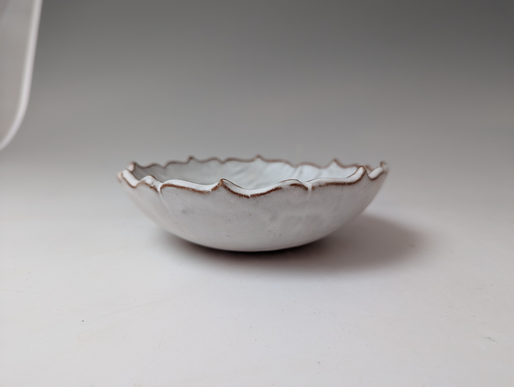
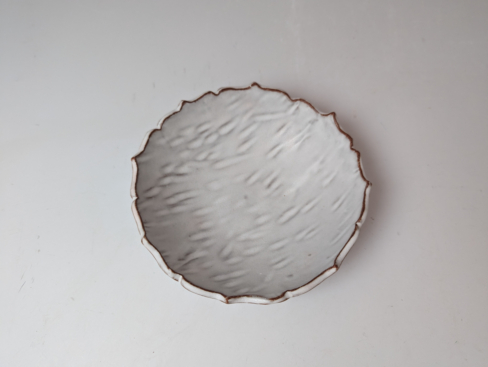
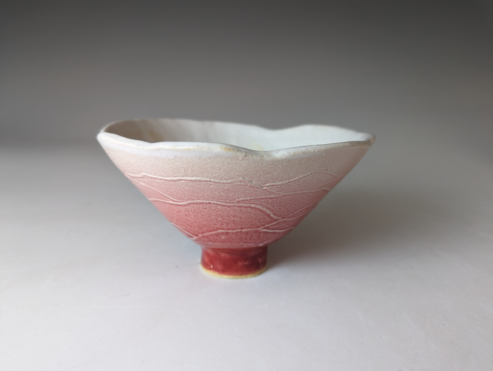
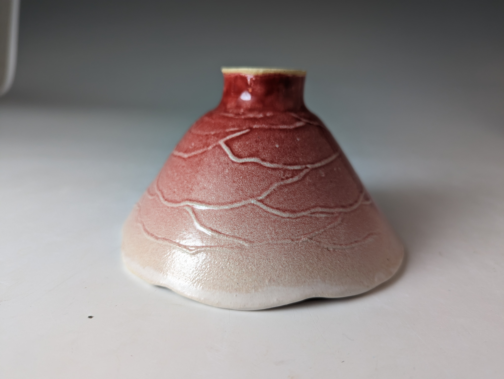
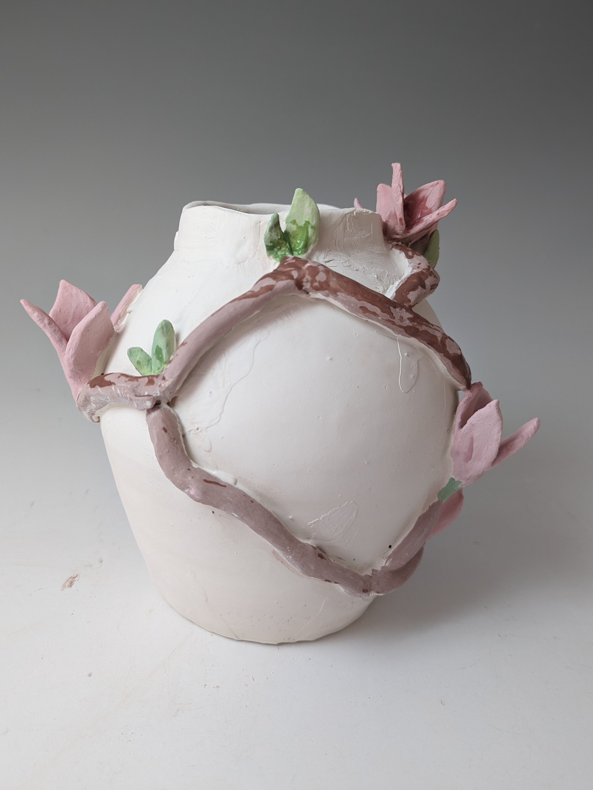
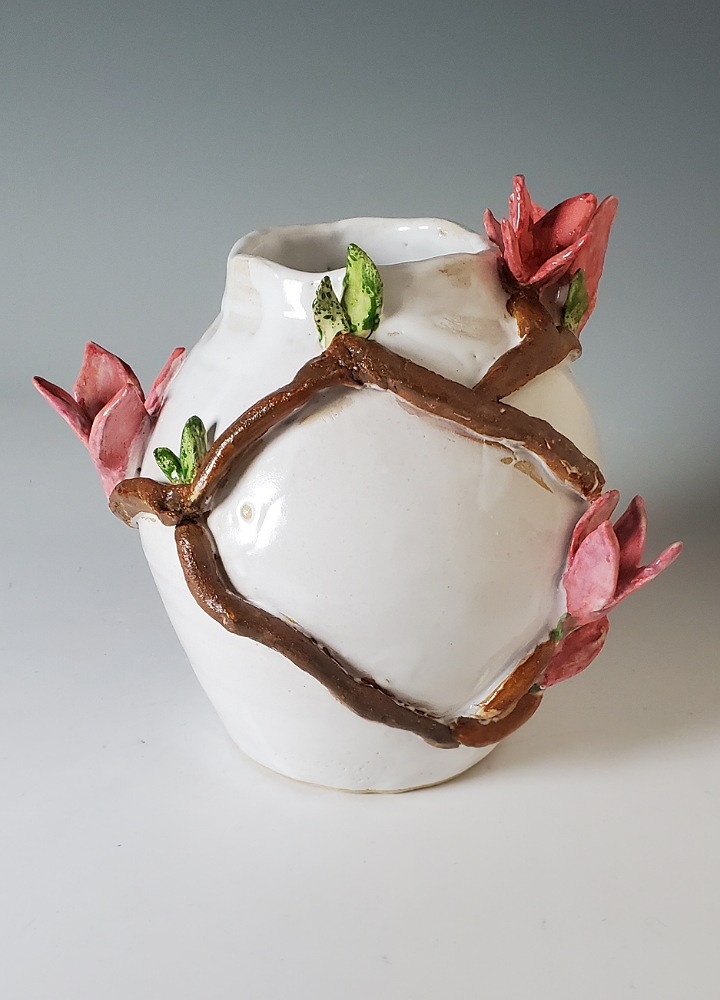

# Pottery
<i> Yet you, Lord, are our Father. We are the clay, you are the potter; we are all the work of your hand. (Isaiah 64:8) </i>

Inspired by a floral theme, my ceramic works have undergone a meticulous process: wedging, throwing, hand building, drying, trimming, piercing, bisque firing, glazing, and the final firing. This process demands extreme attentiveness to detail and patience—much like the experience of being an academic—yet it's so immersive that you easily lose track of time and self, leaving no room for mind-boggling reviews. 🙂

Personally, pottery symbolizes a continuous process of transformation (Jeremiah 1:10). Each piece represents a trajectory of new possibilities, renewal, and hope, serving as a reminder that even amidst chaos and brokenness, our lives can be uplifted, transformed, and elevated to a place of grace, freedom, and fullness. 

## Feather 
This bowl employed an assisted form and sculpting techniques to embellish the outer surface with delicate lines. Stroke marks were made on the inside of the bowl, which was sprayed with spodumene, resulting in a light and matte color and a delicate, tactile sensation akin to the lightness of a feather.

  
  

---

## Rose Bowl
Making from a bisque mold I carved, I sprayed a different combination of glaze, namely Spodumene and Sensei Red, on the outer side of the bowl to produce a gradation effect across the rose-shaped bowl. 

  
  

## Magnolia

This magnolia vase is one of my ceramics series, which symbolizes a life being transformed in multiple stages. It tells a story of renewal and hope that our lives can be transformed and ascended to a place of grace, elegance, and hope even amid chaos and brokenness.

  
  

p.s. I began my pottery journey as I embraced motherhood. It empowers me to transcend the roles of being both a mother and an academic. This marks the commencement of a therapeutic and uplifting journey. Credit to my classmates and teachers, Joy Friedman, Evelyn Snyder, and Cynthia Consentino, whose inspiration and ceramic expertise have profoundly influenced and guided me on this path. 
